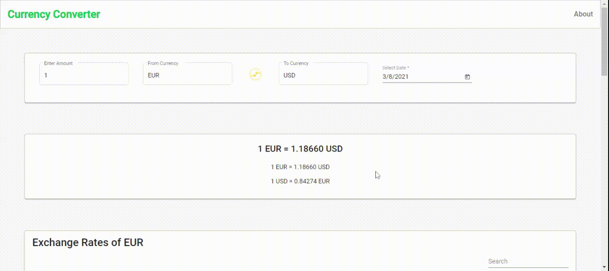
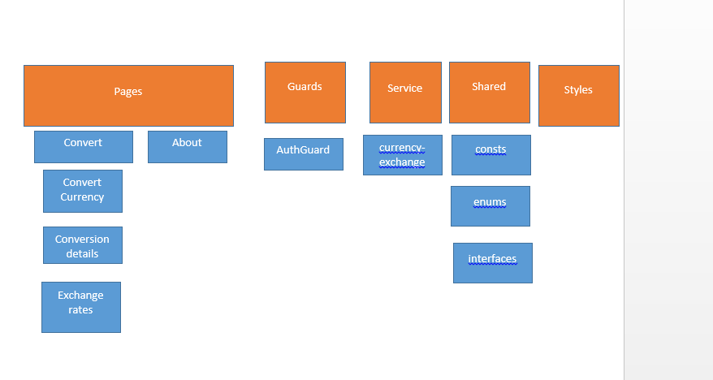

# Front End Assignment: Make A Transaction

## Description

Single page application with the functionality of transferring money and showing the past transactions in a historical transactions list.

## Features

### Currency Coversion ###

- By default when user navigates to page, Amount, From and To fields are pre-populated (with Euro to USD)
- Enter "Amount" field
- Select "From Currency" from populated list. It filters as user types in.
- Select "To Currency" from populated list. It filters as user types in.
- Conversion Details is automatically populated along with Current Date conversion rates.

### Select Date for Conversion Rate ###

- Enter "Amount" field
- Select "From Currency" from populated list. It filters as user types in.
- Select "To Currency" from populated list. It filters as user types in.
- Select "Date" from Date Picker.
- Conversion Details is automatically populated along with the Selected Date conversion rates.

### Bidirectional Conversion  ###

- Enter "Amount" field
- Select "From Currency" from populated list. It filters as user types in.
- Select "To Currency" from populated list. It filters as user types in.
- Conversion Details is automatically populated along with the Selected Date conversion rates.
- Click "Swap" icon in between From Currency and To Currency
- Conversion Details is automatically populated for selected currency types.

### View all Exchange Rates  ###

- Exchange Rates for the Base Currency for all currencies is populated in the table.
- User can search for a currency by typing in Search Filter
- User can sort the rates and currency. 

### About Page to view details of the application  ###

- Click "About" link in the top right navigation bar to view details of application.

### Code Structure ###

## Other Requirements

- Basic Unit testcases are covered to demonstrate knowledge.
- Basic E2E testing are covered to demonstrate knowledge.

# PeachtreeBankDemo

This project was generated with [Angular CLI](https://github.com/angular/angular-cli) version 11.2.2.

## Development server

Run `ng serve` for a dev server. Navigate to `http://localhost:4200/`. The app will automatically reload if you change any of the source files.

## Code scaffolding

Run `ng generate component component-name` to generate a new component. You can also use `ng generate directive|pipe|service|class|guard|interface|enum|module`.

## Build

Run `ng build` to build the project. The build artifacts will be stored in the `dist/` directory. Use the `--prod` flag for a production build.

## Running unit tests

Run `ng test` to execute the unit tests via [Karma](https://karma-runner.github.io).

## Running end-to-end tests

Run `ng e2e` to execute the end-to-end tests via [Protractor](http://www.protractortest.org/).
